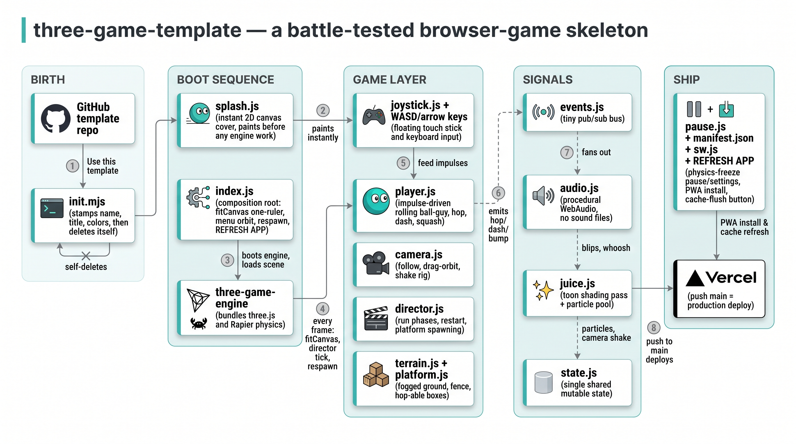

# three-game-template

## Quick start

```bash
gh repo create my-game --template JavierTSalas/three-game-template --private --clone
cd my-game && node init.mjs      # a few prompts (name, title, author, colors) — then it deletes itself
npm install && npm run dev       # playable at http://localhost:8180, LAN-exposed for phones
```

(No `gh`? Click **Use this template** on GitHub instead, then clone and run `node init.mjs`.)

That's a complete, installable, deployable mobile-landscape browser game: boot splash → hero
main menu over a live orbiting world → a rolling ball-guy you drive, hop, and dash around a
platformer sandbox — with pause/settings, PWA install, cache-refresh, tests, and Vercel
deploy already wired. Replace the sandbox with your mechanic.

**Play the live example: https://rollabout.vercel.app** — a game born from this template via
the exact commands above.

## Battle-tested, not theory-crafted

Every pattern here was extracted from shipped, working browser games and hardened on real
devices — iOS Safari, Android Chrome, desktop, installed-PWA and in-tab. The viewport code
alone survived the full gauntlet of URL-bar resizes, fullscreen races, and rotation bugs
(`docs/full-screen-pwa.md` is the war journal). The engine gotchas in `CLAUDE.md` were each
found the hard way. None of this is speculative scaffolding; it all runs, right now, in this
repo — `npm run dev` and drive it.

## What's inside

| Layer | Files | What you get |
|---|---|---|
| Boot | `index.js`, `scripts/splash.js` | instant 2D splash before any engine work; world spawns behind the cover; menu reveals only when ready |
| Engine | `game.json`, `scenes/`, `game_objects/` | three-game-engine v0.10 (three.js + Rapier) with a components-JSON scene, valid fog, prefabs |
| Feel | `scripts/player.js`, `camera.js`, `juice.js`, `audio.js` | impulse-driven rolling, squash & stretch, follow/orbit/shake camera, toon pass, particles, procedural sound (no audio files) |
| Input | `scripts/joystick.js` + keyboard fallback | floating touch stick, WASD **and** arrow keys, hop/dash buttons |
| Shell | `index.html`, `scripts/pause.js`, `fullscreen.js` | one-ruler fullscreen CSS, hero menu, pause-as-settings (sound toggle), rotate hint, credits |
| PWA | `manifest.json`, `sw.js`, ↻ REFRESH APP | installable, landscape-locked, with a shipped cache-flush button for stale installs |
| Rigor | `logic.js`, `logic.test.js`, `node --test` | pure math + tuning in one tested file; `window.__state` hooks for Playwright driving |
| Deploy | `vercel.json` | import the repo in Vercel once; every push to `main` deploys |
| Knowledge | `CLAUDE.md`, `docs/` | engine gotchas, viewport/PWA playbook, 3D asset conversion playbook |

## Controls (shipped defaults)

- **Touch:** floating joystick in the bottom-left zone (appears under your thumb) ·
  double-tap the stick = dash · **HOP** and **DASH** buttons · drag the right half
  of the screen = orbit camera.
- **Desktop:** **WASD or arrow keys** roll · **Space** = hop · **E** (or Shift) = dash ·
  drag = orbit · **Esc** = pause.

## Developing the template itself

The template is a running game — that's the point. `npm run dev`, drive it, and any
improvement you make is playtested before a new game ever inherits it. `npm test` covers the
pure math and the init script. When a game of yours grows something reusable (a better
camera, a cleaner pause), cherry-pick it back here by hand; the template is small enough that
drift stays visible.

## Architecture



## After you init

`node init.mjs` renames `README.game.md` over this file, stamps your name/title/colors into
the shell, and deletes itself. Then: replace `icons/` with your art, import the repo at
vercel.com → every push deploys, and start replacing the sandbox (see "Growing a game from
the skeleton" in `CLAUDE.md`).

## License & credits

MIT (see `LICENSE`). Built on the shoulders of:

- **[three-game-engine](https://github.com/WesUnwin/three-game-engine)** by Wes Unwin (MIT) —
  bundling **[three.js](https://threejs.org)** (MIT), **[Rapier](https://rapier.rs)** physics
  by Dimforge (Apache-2.0), and **three-mesh-ui** (MIT)
- Fonts: **Luckiest Guy** by Astigmatic and **Baloo 2** by Ek Type (both SIL Open Font License)
- Tooling: webpack · Playwright · Blender · gltf-transform · Vercel · Tripo
